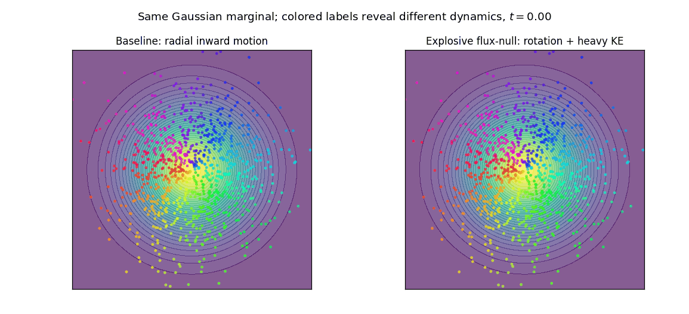

# [On The Hidden Biases of Flow Matching Samplers](https://arxiv.org/abs/2512.16768)

Flow matching (FM) constructs continuous-time ODE samplers by prescribing probability paths between a base distribution and a target distribution. In this note, we study FM through the lens of finite-sample plug-in estimation. In addition to replacing population expectations by sample averages, one may replace the target distribution itself by a finite-sample surrogate, ranging from the empirical measure to a smoothed estimator. This viewpoint yields a natural hierarchy of empirical FM models. For affine conditional flows, we derive the exact empirical minimizer and identify a smoothed plug-in regime in which the terminal law is exactly a kernel-mixture estimator. This plug-in perspective clarifies several coupled finite-sample biases of empirical FM. First, replacing the target law by a finite-sample surrogate changes the statistical target. Second, the empirical minimizer is generally not a gradient field, even when each conditional flow is. Third, a fixed empirical marginal path does not determine a unique particle dynamics: one may add extra vector fields whose probability flux has zero divergence without changing the marginal path. For Gaussian affine conditional paths, we give explicit families of such flux-null corrections. Finally, the source distribution provides a primary mechanism controlling upper tails of kinetic energy. In particular, Gaussian bases yield exponential upper-tail bounds for instantaneous and integrated kinetic energies, whereas polynomially tailed bases yield corresponding polynomial upper-tail bounds. 

🔑 **We know that an ODE sampler can often be paired with an SDE sampler that realizes the same marginal density path. The flux-null vector field correction reveals another axis of freedom: even after restricting ourselves to purely deterministic ODE dynamics, we can modify the particle trajectories and kinetic-energy tail behavior while preserving the same one-time marginals** 😮 

The above message is true for both neural and empirical FM sampler. The animations shown below are obtained with empirical FM samplers which our paper focus on:




## **Citation**
If you find our work useful for your research, please consider citing our paper:
```
@article{lim2025hidden,
  title={On The Hidden Biases of Flow Matching Samplers},
  author={Lim, Soon Hoe},
  journal={arXiv preprint arXiv:2512.16768},
  year={2025}
}
```
